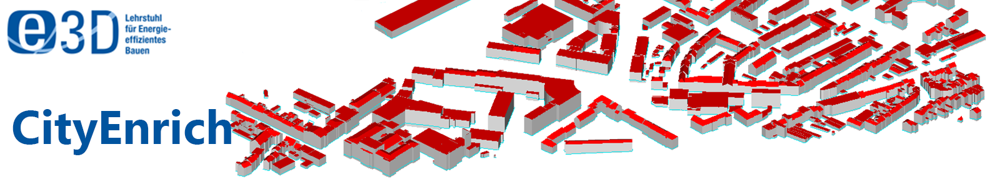

# CityEnrich - CityGML manual enrichment tool 

The CityGML Enrichment Tool (CityEnrich) is developed by members of the  "Institute of Energy Efficiency and Sustainable Building (e3D), RWTH Aachen University" using Python 3.8+.
This tool can be used to enrich CityGML buildings with energy-related data manually. The added information is saved according to the Energy Application Domain Extention (EnergyADE) version 1.0.
The software offers a JSON-based database adopted from [TEASER](https://github.com/RWTH-EBC/TEASER) to select building materials. The program allows enriching multiple buildings at once or individually. 

This tool bridges the gap between automated archetype style enrichment and editing the CityGML file in the source code by hand.

If you have any questions regarding CityEnrich, feel free to contact us at: [cityatb@e3d.rwth-aachen.de](mailto:cityatb@e3d.rwth-aachen.de)

## Version

The CityEnrich is currently being developed. Currently, CityEnrich is available in version 0.1.

## How to use CityEnrich

### Dependencies

CityATB is currently being developed using Python 3.8+ and PySide2 Python bindings.
Furthermore, the following external libraries/python packages are used in the different functionalities of CityEnrich:
1. pandas
2. lxml

### Installation

The CityEnrich can be used by cloning or downloading the whole CityEnrich package from the GIT Repository. Moreover, the user needs to run the "main.py" to load the GUI.  

### How to contribute to the development of CityATB

I want to invite you to contribute to the development of CityEnrich. You may report any issues using the [Issues](https://github.com/RWTH-E3D/CityEnrich/issues) button.

## How to cite CityEnrich

AN OPEN-SOURCE CITYGML ENRICHMENT TOOL (CITYENRICH). Avichal Malhotra,Maxim Shamovich, Simon Raming, Jérôme Frisch, Christoph van Treeck. IBPSA BauSIM 2022, September 2022, Weimar [pdf](https://www.researchgate.net/publication/368679159_AN_OPEN-SOURCE_CITYGML_ENRICHMENT_TOOL_CITYENRICH).

## License

CityEnrich is released by RWTH Aachen University, E3D - Institute of Energy Efficiency and Sustainable Building, under the [MIT License](https://github.com/RWTH-E3D/cityenrich/blob/main/LICENSE).
